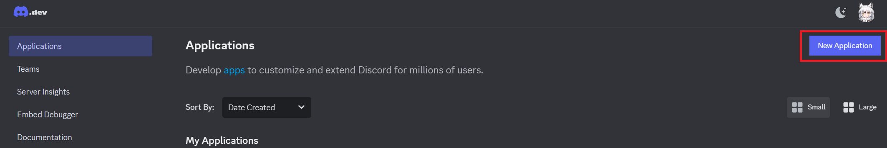
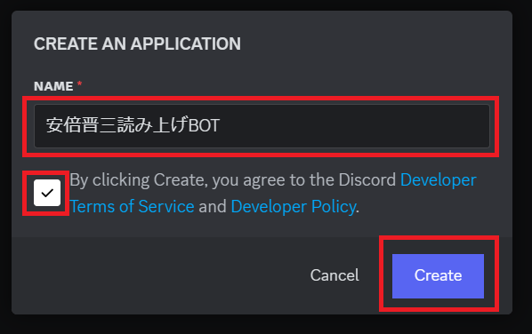
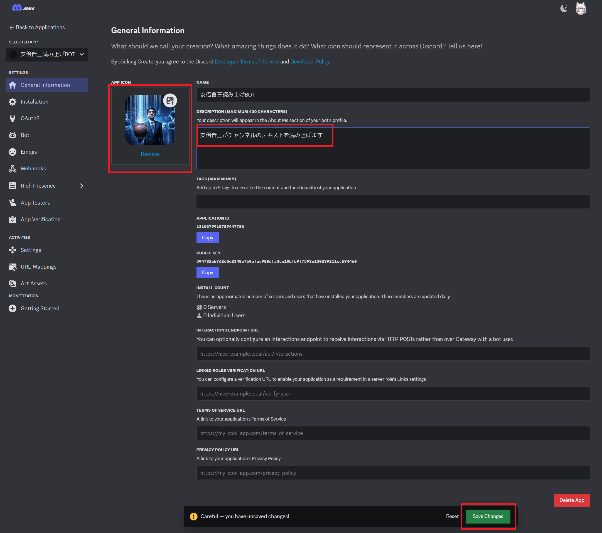
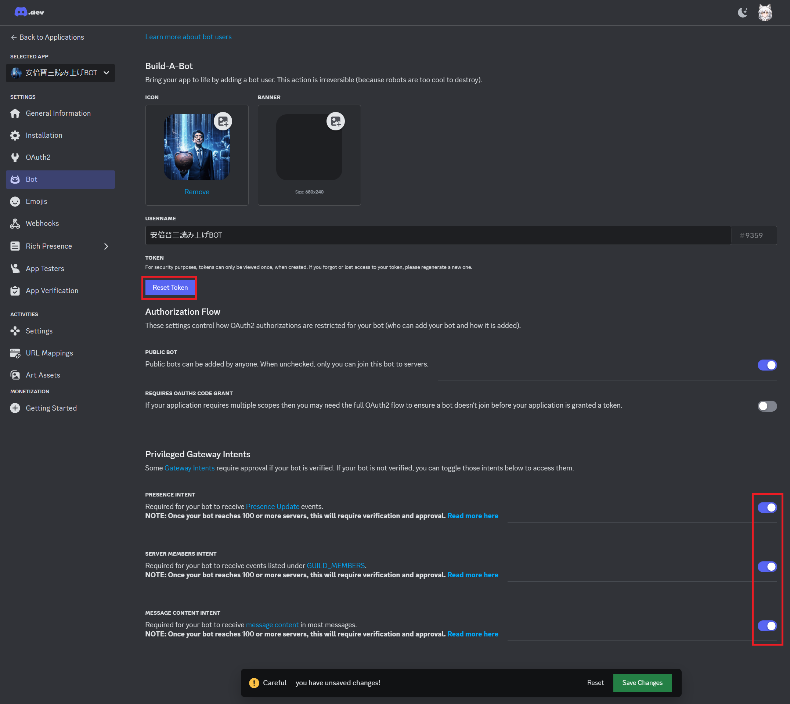
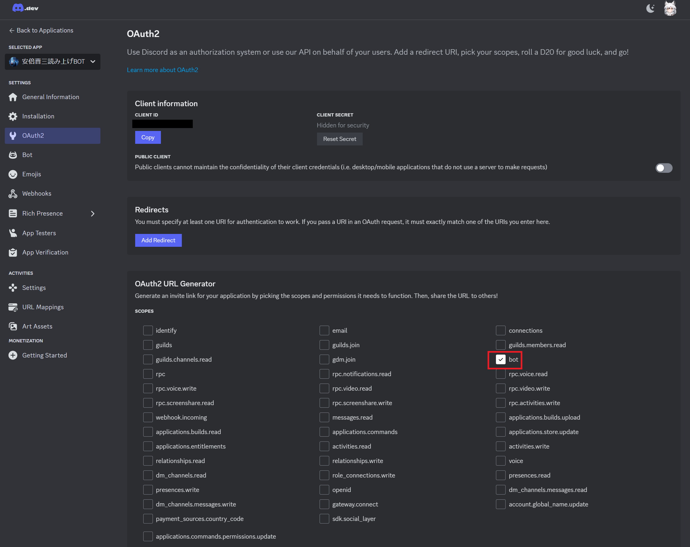
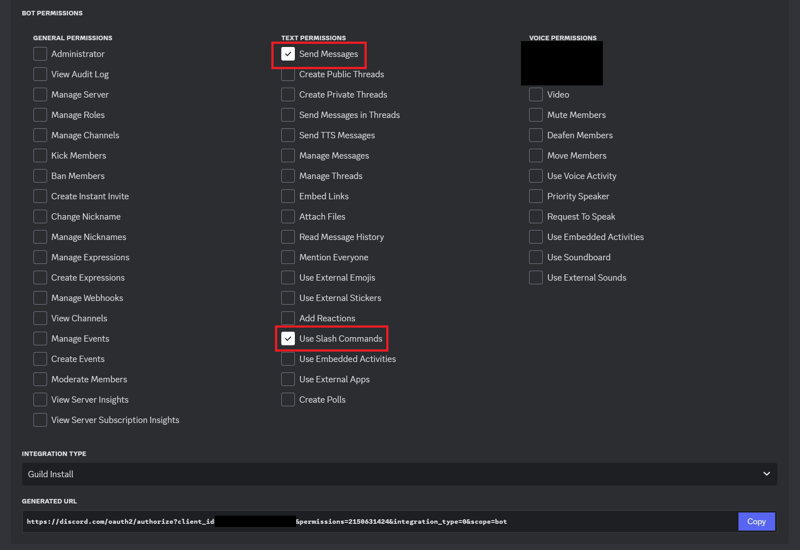
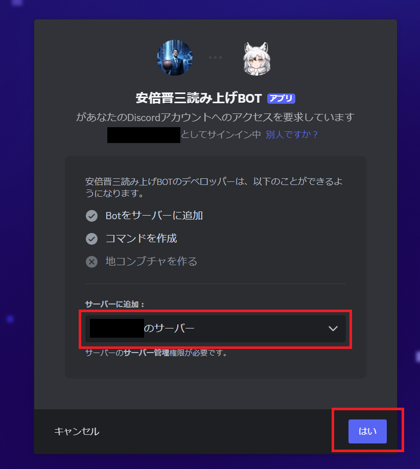
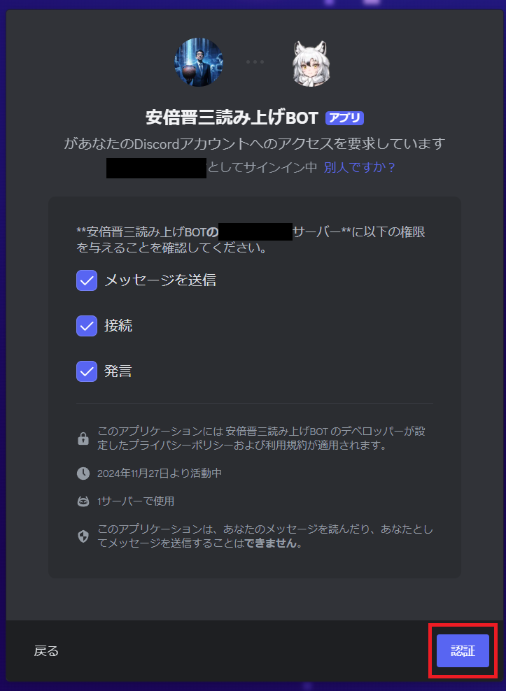

# 安倍晋三Discord読み上げボット

Discordのチャンネルに常駐し、投稿されたテキストを読み上げます。

## 使用モデルについて

晋バルサン氏の公開しているStyle-Bert-VITS2用のモデルをダウンロードし使用しています。<br>
https://huggingface.co/AbeShinzo0708/AbeShinzo_Style_Bert_VITS2

## 使用方法
1. Pythonの仮想環境を作成し、その中に必須パッケージをインストールします。

    Windows
    ```
    git clone https://github.com/arcticwolf666/AbeShinzoBot
    cd AbeShinzoBot
    python -m venv venv
    venv\Scripts\activate
    pip install torch torchvision torchaudio --index-url https://download.pytorch.org/whl/cu118
    pip install -r requirements.txt
    ```

    Linux(Ubuntu-22.04)
    ```
    git clone https://github.com/arcticwolf666/AbeShinzoBot
    cd AbeShinzoBot
    python -m venv venv
    source venv/bin/activate
    pip install torch torchvision torchaudio --index-url https://download.pytorch.org/whl/cu118
    pip install -r requirements.txt
    sudo apt-get install libopus0
    ```

    CPUでも実用的な時間で音声合成できますが、CUDAを使用する事もできます。<br>
    CUDAが使用できない環境下ではCPUにフォールバックします。<br>
    CUDAを使用する場合CUDA Toolkit 11.8をインストールして下さい。<br>
    https://developer.nvidia.com/cuda-11-8-0-download-archive

2. Discord上アプリケーションを作成する

    https://discord.com/developers/applications からアプリケーションを作成する。
    
    
    
    BOTを作成します、ResetTokenで新たなトークンが生成されるので token.txt にそれを記述します。
    
    BOTをサーバに追加する為のURLを取得します(GENERATED URL)
    
    
    BOTをサーバに追加する、前のGENERATED URLをブラウザで開きサーバにBOTを追加します。
    
    

3. token.txtを作成しDiscordで発行されたBOTのトークンを張り付け保存します。

4. Pythonの仮想環境上でBOTを動かす

    ```
    venv\Scripts\activate
    python discordbot.py
    ```
    Ctrl+Cで終了します。

5. 読み上げる

    Discordのチャンネルで !abe とコマンドを打つと、そのチャンネルに読み上げBOTが接続します。<br>
    以後テキストが読み上げられる筈です。<br>
    BOTの接続を解除するには !yamagami とコマンドを打って下さい。<br>

6. 正規表現で特定のワードを書き換える

    replace.csv に "正規表現","置換後文字列" を記述する事で特定の単語を置き換える事ができます。
    BOTがうまく読まない単語を、ひらがなで記述する事で一応読み上げる様になります。