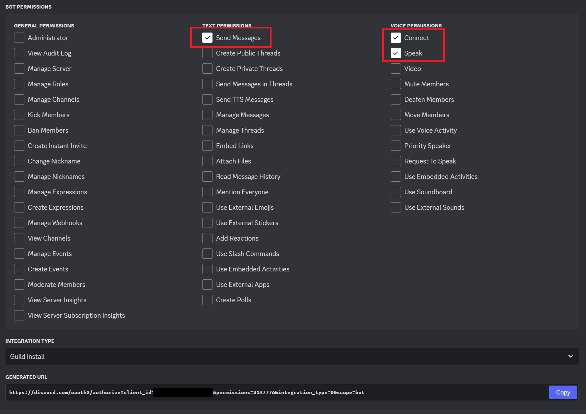

# 安倍晋三Discord読み上げボット

Discordのチャンネルに常駐し、投稿されたテキストを読み上げます。

## 使用モデルについて
    晋バルサン氏の公開しているStyle-Vert-VITS2用のモデルをダウンロードし使用しています。
    https://huggingface.co/AbeShinzo0708/AbeShinzo_Style_Bert_VITS2

## 使用方法
1. Pythonの仮想環境を作成し、その中にStyle-Bert-VITS2をインストールします

    ```
    python -m venv venv
    venv\Scripts\activate
    pip install torch torchvision torchaudio --index-url https://download.pytorch.org/whl/cu118
    pip install style-bert-vits2
    pip install PyNaCl
    pip install discord.py
    ```

    ffmpegを内部で使用するので、venv\Scripts 以下に bin 以下の実行ファイルを複製して下さい。
    https://www.gyan.dev/ffmpeg/builds/ffmpeg-release-essentials.7z

2. Discord上アプリケーションを作成する

    https://discord.com/developers/applications からアプリケーションを作成する
    
    
    
    BOTを作成します
    
    BOTをサーバに追加する為のURLを取得します(GENERATED URL)
    
    
    BOTをサーバに追加する、前のGENERATED URLをブラウザで開きサーバにBOTを追加します。
    
    

3. discordbot.py の TOKEN をDiscordで発行されたBOTトークンに書き換えて下さい。

    ```
    TOKEN="DiscordのBOTで生成したトークンに書き換える"
    ```
4. Pythonの仮想環境上でBOTを動かす

    ```
    venv\Scripts\activate
    python discordbot.py
    ```
5. 読み上げる

    Discordのチャンネルで /join とコマンドを打つと、そのチャンネルに読み上げBOTが接続します。<br>
    以後テキストが読み上げられる筈です。<br>
    BOTの接続を解除するには /leave とコマンドを打って下さい。<br>